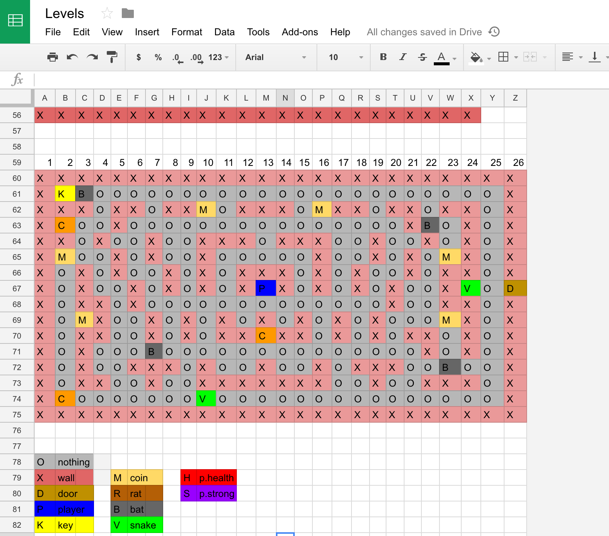

  

 

# 1st project for WDI26 London

 

Welcome to my first project for the WDI course in GA London. I decided to create a traditional roguelike game with pixel art graphics. I redrew most of the art by using <a href="https://make8bitart.com/">make8bitart</a>, and recorded most of the sounds at home.

I learned how to draw the levels by reading the <a href="http://eloquentjavascript.net/15_game.html">chapter 15 of Eloquent Javascript</a>. Writing this game was a bit tricky in the beginning, once I got used to the logic it turned fairly simple as I had to repeat most of it for the different scenarios.

I'd say that the attacks of the enemies and the potions were the most challenging part of the creation of this game. I enjoyed a lot drawing most of the stuff and making it more personalized.

___
### Instructions:
You need to get a key to be able to open the door: 

Once you go through the door you'll go to the next level. Earn points by collecting the coins in every level. Low on health? Don't worry, just drink a health potion or it'll be restored when you pass the level. You will find some enemies and also the following potions throughout the levels:

### Potions:

The health potion:
 

<i>If you get the health potion your health will be restored by 40pts.</i>

The strong potion:
 

<i> If you get the strong potion your attacks will be way stronger for 20 seconds.</i>

 

### Controls:

- W ||  ArrowUp  
- D ||  ArrowRight  
- S ||  ArrowDown  
- A ||  ArrowLeft  
- spacebar || spacebar  

---
## Languages:
- HTML5
- CSS3
- JS

## Libraries:
- <a href="https://jquery.com/">JQuery</a>
- <a href="https://fonts.google.com/">Google Fonts</a>

## Inspiration:
- <a href="http://pixeldungeon.watabou.ru/">Pixel dungeon</a>
- <a href="http://undertale.com/">Undertale</a>

## Credits:
- <a href="https://www.reddit.com/r/PixelArt/comments/5wmq30/oc_alien_temple/">Background</a>
- <a href="http://freesound.org/">Sound effects</a>
- <a href="https://www.youtube.com/watch?v=mqzBv3FYpr0">Main theme music</a>
- <a href="https://www.youtube.com/watch?v=cqxk6_ATBPI">Other theme music</a>
- <a href="https://www.youtube.com/watch?v=EjazC45Qkww">Final level theme music</a>

## Extra work:

### Designing the levels:

I chose to design each level because if it was randomized it might've trap key objects such as the key or enemies, and I would like to provide the user the best experience for the game.

I used Google Sheets to help me with this task as I could set some formatting rules with colors corresponding to the letters that would better help me visualize the level.

