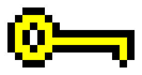
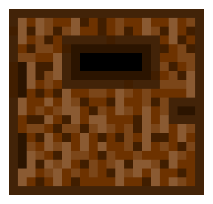

  

___
## First project for WDI London:

Welcome to my first project for the WDI course in GA London. I decided to create a traditional roguelike game with pixel art graphics. I redrew most of the art by using <a href="https://make8bitart.com/">make8bitart</a>, and recorded most of the sounds at home.

I learned how to draw the levels by reading the <a href="http://eloquentjavascript.net/15_game.html">chapter 15 of Eloquent Javascript</a>. Writing this game was a bit tricky in the beginning, once I got used to the logic it turned fairly simple as I had to repeat most of it for the different scenarios.

I'd say that the attacks of the enemies and the potions were the most challenging part of the creation of this game. I enjoyed a lot drawing most of the stuff and making it more personalized.

___
## Instructions:
You need to get a key to be able to open the door:

Once you go through the door you'll go to the next level. You can earn points by collecting the coins. You will find some enemies and also the following potions throughout the levels:

## Potions:

-The health potion:
 

<i>If you get the health potion your health will be restored by 40pts.</i>

-The fast potion:
 

<i>If you get the fast potion you'll move much faster.</i>

-The strong potion:
 

<i> If you get the strong potion the attacks that you'll receive will damage your health less. </i>

## Controls:
 

W ||  ArrowUp  
D ||  ArrowRight  
S ||  ArrowDown  
A ||  ArrowLeft  
spacebar || spacebar  

---
Inspiration: 
*<a href="http://pixeldungeon.watabou.ru/">Pixel dungeon</a>
*<a href="http://undertale.com/">Undertale</a>

